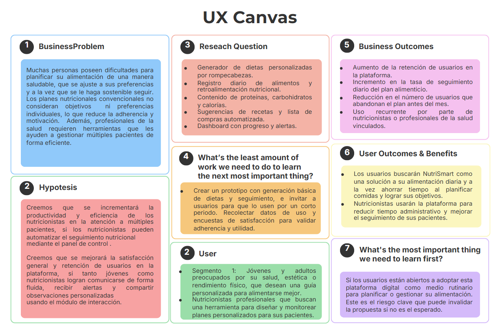

    

<h1 align="center">
    Universidad Peruana de Ciencias Aplicadas
</h1>

<h3 align="center">
    Carrera: Ingeniería de Software
       
    Curso: SI729 - Desarrollo de Aplicaciones Open Source
       
    Sección: 4328
       
    Profesor: Juan Antonio Flores Moroco
       
    Ciclo: 2025-01 
       
    Informe de Trabajo Final
       
    Startup: NutriVid
       
    Producto: NutriSmart  
</h3>

| 
Alumno
       | 
Código
 |
|:-------------------------------------------:|:-------------------------------------:|
|  Paredes Santos, Fabrizio Alberto           |              u202310914               |
|       Ríos Pacheco, Héctor Javier           |              u2023                    |
| Prieto Mantari, Leonardo Fabrizzio Junior   |              u202319949               |
|       Rodriguez Macedo, Sebastian           |              u202310199               |
|       Linares Arroyo, Jorge Alexandro       |              u202318624               |

 Abril 2025 

## Registro de Versiones del Informe

## Project Report Collaboration Insights  

## Tabla de Contenidos

    
Capítulo I: Introducción 
    
        <ul>
            <li><a href="#11-Startup-Profile">1.1. Startup Profile</a></li>
            <li><a href="#111-Descripción-de-la-Startup">1.1.1. Descripción de la Startup</a></li>
            <li><a href="#112-Perfiles-de-Integrantes-del-Equipo">1.1.2. Perfiles de Integrantes del Equipo</a></li>
            <li><a href="#12-Solution-Profile">1.2. Solution Profile</a></li>
            <li><a href="#121-Antecedentes-y-Problemática">1.2.1. Antecedentes y Problemática</a></li>
            <li><a href="#122-Lean-UX-Process">1.2.2. Lean UX Process</a></li>
            <li><a href="#1221-Lean-UX-Problem-Statements">1.2.2.1. Lean UX Problem Statements</a></li>
            <li><a href="#1222-Lean-UX-Assumptions">1.2.2.2. Lean UX Assumptions</a></li>
            <li><a href="#1223-Lean-UX-Hypothesis-Statements">1.2.2.3. Lean UX Hypothesis Statements</a></li>
            <li><a href="#1224-Lean-UX-Canvas">1.2.2.4. Lean UX Canvas</a></li>
            <li><a href="#13-Segmentos-Objetivos">1.3. Segmentos Objetivos</a></li>
        </ul>    

    
Capítulo II: Requirements Elicitation & Analysis

        <ul>
            <li><a href="#21-competidores">2.1. Competidores</a></li>
            <li><a href="#211-Análisis-competitivo">2.1.1. Análisis competitivo</a></li>
            <li><a href="#212-Estrategias-y-tácticas-frente-a-competidores">2.1.2. Estrategias y tácticas frente a competidores</a></li>
            <li><a href="#22-Entrevistas">2.2. Entrevistas</a></li>
            <li><a href="#221-Diseño-de-entrevistas">2.2.1. Diseño de entrevistas</a></li>
            <li><a href="#222-Registro-de-entrevistas">2.2.2. Registro de entrevistas</a></li>
            <li><a href="#223-Análisis-de-entrevistas">2.2.3. Análisis de entrevistas</a></li>
            <li><a href="#23-Needfinding">2.3. Needfinding</a></li>
            <li><a href="#231-User-Personas">2.3.1. User Personas</a></li>
            <li><a href="#232-User-Task-Matrix">2.3.2. User Task Matrix</a></li>
            <li><a href="#233-User-Journey-Mapping">2.3.3. User Journey Mapping</a></li>
            <li><a href="#234-Empathy-Mapping">2.3.4. Empathy Mapping</a></li>
            <li><a href="#235-As-is-Scenario-Mapping">2.3.5. As-is Scenario Mapping</a></li>
            <li><a href="#24-Ubiquitous-Language">2.4. Ubiquitous Language</a></li>
        </ul>   

    
Capítulo III: Requirements Specification 

        <ul>
            <li><a href="#31-To-Be-Scenario-Mapping">3.1. To-Be Scenario Mapping</a></li>
            <li><a href="#32-User-Stories">3.2. User Stories</a></li>
            <li><a href="#33-Impact-Mapping">3.3. Impact Mapping</a></li>
            <li><a href="#34-Product-Backlog">3.4. Product Backlog</a></li>
        </ul>    

    
Capítulo IV: Product Design 

        <ul>
            <li><a href="#41-Style-Guidelines">4.1. Style Guidelines</a></li>
            <li><a href="#411-General-Style-Guidelines">4.1.1. General Style Guidelines</a></li>
            <li><a href="#412-Web-Style-Guidelines">4.1.2. Web Style Guidelines</a></li>
            <li><a href="#42-Information-Architecture">4.2. Information Architecture</a></li>
            <li><a href="#421-Organization-Systems">4.2.1. Organization Systems</a></li>
            <li><a href="#422-Labeling-Systems">4.2.2. Labeling Systems</a></li>
            <li><a href="#423-SEO-Tags-and-Meta-Tags">4.2.3. SEO Tags and Meta Tags</a></li>
            <li><a href="#424-Searching-Systems">4.2.4. Searching Systems</a></li>
            <li><a href="#425-Navigation-Systems">4.2.5. Navigation Systems</a></li>
            <li><a href="#43-Landing-Page-UI-Design">4.3. Landing Page UI Design</a></li>
            <li><a href="#431-Landing-Page-Wireframe">4.3.1. Landing Page Wireframe</a></li>
            <li><a href="#432-Landing-Page-Mock-up">4.3.2. Landing Page Mock-up</a></li>
            <li><a href="#44-Web-Applications-UXUI-Design">4.4. Web Applications UX/UI Design</a></li>
            <li><a href="#441-Web-Applications-Wireframes">4.4.1. Web Applications Wireframes</a></li>
            <li><a href="#442-Web-Applications-Wireflow-Diagrams">4.4.2. Web Applications Wireflow Diagrams</a></li>
            <li><a href="#443-Web-Applications-Mock-ups">4.4.3. Web Applications Mock-ups</a></li>
            <li><a href="#444-Web-Applications-User-Flow-Diagrams">4.4.4. Web Applications User Flow Diagrams</a></li>
            <li><a href="#45-Web-Applications-Prototyping">4.5. Web Applications Prototyping</a></li>
            <li><a href="#46-Domain-Driven-Software-Architecture">4.6. Domain-Driven Software Architecture</a></li>
            <li><a href="#461-Software-Architecture-Context-Diagrams">4.6.1. Software Architecture Context Diagrams</a></li>
            <li><a href="#462-Software-Architecture-Container-Diagrams">4.6.2. Software Architecture Container Diagrams</a></li>
            <li><a href="#463-Software-Architecture-Components-Diagrams">4.6.3. Software Architecture Components Diagrams</a></li>
            <li><a href="#47-Software-Object-Oriented-Design">4.7. Software Object-Oriented Design</a></li>
            <li><a href="#471-Class-Diagrams">4.7.1. Class Diagrams</a></li>
            <li><a href="#472-Class-Dictionary">4.7.2. Class Dictionary</a></li>
            <li><a href="#48-Database-Design">4.8. Database Design</a></li>
            <li><a href="#481-Database-Diagram">4.8.1. Database Diagram</a></li>
        </ul>    

    
Capítulo V: Product Implementation, Validation & Deployment 

        <ul>
            <li><a href="#51-software-configuration-management">5.1. Software Configuration Management</a></li>
            <li><a href="#511-software-development-environment-configuration">5.1.1. Software Development Environment Configuration</a></li>
            <li><a href="#512-source-code-management">5.1.2. Source Code Management</a></li>
            <li><a href="#513-source-code-style-guide-conventions">5.1.3. Source Code Style Guide & Conventions</a></li>
            <li><a href="#514-software-deployment-configuration">5.1.4. Software Deployment Configuration</a></li>
            <li><a href="#52-landing-page-services-applications-implementation">5.2. Landing Page, Services & Applications Implementation</a></li>
            <li><a href="#521-sprint-1">5.2.1. Sprint 1</a></li>
            <li><a href="#5211-sprint-planning-1">5.2.1.1. Sprint Planning 1</a></li>
            <li><a href="#5212-aspect-leaders-and-collaborators">5.2.1.2. Aspect Leaders and Collaborators</a></li>
            <li><a href="#5213-sprint-backlog-1">5.2.1.3. Sprint Backlog 1</a></li>
            <li><a href="#5214-development-evidence-for-sprint-review">5.2.1.4. Development Evidence for Sprint Review</a></li>
            <li><a href="#5215-execution-evidence-for-sprint-review">5.2.1.5. Execution Evidence for Sprint Review</a></li>
            <li><a href="#5216-services-documentation-evidence-for-sprint-review">5.2.1.6. Services Documentation Evidence for Sprint Review</a></li>
            <li><a href="#5217-software-deployment-evidence-for-sprint-review">5.2.1.7. Software Deployment Evidence for Sprint Review</a></li>
            <li><a href="#5218-team-collaboration-insights-during-sprint">5.2.1.8. Team Collaboration Insights during Sprint</a></li>
        </ul>        

## Student Outcome

## Capítulo I: Introducción 

### 1.1. Startup Profile
Somos un equipo de estudiantes de la Universidad Peruana de Ciencias Aplicadas (UPC) motivados en desarrollar una solución diferente que cuyo objetivo principal sea ayudar a las personas a generar planes de comida personalizados basados en sus preferencias, objetivos de salud y necesidades nutricionales. 

#### 1.1.1. Descripción de la Startup
Nuestra aplicación web, NutriSmart, es una aplicación web diseñada para facilitar la creación de planes de comida adaptados a las necesidades específicas de cada persona. Ya sea para quienes buscan alcanzar objetivos de salud, mejorar su nutrición o gestionar dietas con restricciones alimenticias usando excepciones y restricciones específicas, con una interfaz amigable y herramientas eficientes, dando una experiencia sencilla y accesible para todos los usuarios.

**Misión:** Ofrecer a nuestros usuarios una herramienta accesible y eficiente para mejorar su bienestar a través de la alimentación personalizada, ayudándoles a alcanzar sus metas de salud y nutrición con facilidad y precisión.

**Visión:** Convertirnos en la plataforma líder en soluciones de planificación de alimentos personalizados, proporcionando a millones de usuarios la oportunidad de tomar decisiones alimenticias informadas y alineadas con sus objetivos de salud a nivel global.

#### 1.1.2. Perfiles de Integrantes del Equipo

#### 1.2. Solution Profile
NutriSmart es una plataforma web que permite a los usuarios crear planes de comida de manera personalizada basados en sus preferencias, objetivos de salud, restricciones médicas y necesidades nutricionales: Esto se da mediante un perfil propio, pues la aplicación adapta las recomendaciones alimenticias a restricciones y excepciones, brindando una experiencia diferente. Además, incluye herramientas de seguimiento y análisis que permiten ajustar los planes según los avances y metas del usuario. Con un modelo freemium, la versión básica ofrece funcionalidades esenciales de personalización, mientras que las opciones premium brindan acceso a características avanzadas como análisis nutricionales detallados. NutriSmart se posiciona como una solución integral para aquellos que buscan mejorar su bienestar a través de una alimentación controlada y alineada con sus objetivos de salud.

#### 1.2.1. Antecedentes y problemática
Dentro de un contexto en el que los problemas de salud relacionados con la mala alimentación y el creciente sedentarismo, nace la necesidad de contar con herramientas personalizadas y a la vez accesibles para gestionar una dieta y de esa manera conseguir un bienestar. El incremento de este tipo de demanda de soluciones nutricionales a medida, la falta de aplicaciones eficaces que se adapten de manera personalizada a cada persona, junto con la proliferación de enfermedades de tipo crónico como la obesidad, diabetes, entre otras condiciones ha puesto en necesidad este tipo de aplicaciones.

**Who:** NutriSmart está dirigida a personas que desean mejorar su alimentación, gestionar dietas con restricciones específicas, alcanzar metas de salud propias o a personal de salud profesional que pueden hacer uso de esta como un complemento a sus pacientes. Asimismo esto incluye a personas con condiciones como diabetes, hipertensión o que simplemente buscan un estilo de vida más saludable.

**What:** La problemática principal es la dificultad de encontrar una solución accesible y eficiente que permita a las personas crear planes de comida totalmente adaptados a sus preferencias, objetivos y restricciones alimenticias. Actualmente, muchas aplicaciones no ofrecen planes suficientemente personalizables o no consideran las necesidades específicas de los usuarios.

**Where:**  Esta problemática afecta a un gran espectro de usuarios, desde aquellos en áreas urbanas con acceso a tecnología, hasta personas en zonas rurales con dificultades para encontrar soluciones nutricionales adecuadas a sus necesidades. NutriSmart tiene como objetivo llegar a todas ellas al ser accesible a cualquier persona con internet.

**When:** La necesidad de soluciones personalizadas es más urgente en un contexto post-pandemia, donde la conciencia sobre la salud y la nutrición se ha incrementado, y las personas buscan alternativas para cuidar su bienestar físico a largo plazo.

**Why:** La razón principal de la creación de NutriSmart es la creciente demanda de herramientas que no solo ayuden a gestionar la dieta, sino que también ofrezcan un enfoque personalizado y adaptable a cada usuario. 

**How:** NutriSmart aborda este problema mediante una plataforma web que permite a los usuarios crear perfiles detallados donde pueden ingresar sus objetivos de salud, preferencias alimenticias y restricciones. A través de un sistema de recomendaciones inteligentes, la aplicación proporciona planes de comida adaptados a estas necesidades.

**How Much:** El costo de implementar esta solución es bajo comparado con los beneficios potenciales, considerando que el modelo de negocio de NutriSmart incluye una versión básica gratuita y suscripciones premium que brindan características adicionales. Esto permite que la aplicación sea accesible a una amplia audiencia, desde usuarios individuales hasta instituciones de salud que deseen promover dietas personalizadas.

#### 1.2.2. Lean UX Process

#### 1.2.2.1. Lean UX Problem Statements
Actualmente, muchas personas interesadas en mejorar su salud a través de una mejor alimentación no logran mantener una planificación constante y adaptada a sus necesidades específicas. Esto genera frustración, desmotivación y poca adherencia a sus objetivos nutricionales.

¿Cómo podemos ayudar a que los usuarios mantengan una planificación alimentaria personalizada de forma constante y efectiva, alineada a sus metas de salud y estilo de vida, a través del uso de NutriSmart?

**Domain:** El dominio de NutriSmart se centra en la nutrición personalizada y la gestión de dietas adaptadas a las necesidades de salud de los usuarios. El software será una herramienta integral que permita a las personas gestionar su alimentación de manera eficaz, considerando sus restricciones dietéticas, preferencias y metas de salud.

**Customer Segments:** El producto está dirigido a personas de todas las edades que buscan mejorar su salud mediante una dieta personalizada. Esto incluye a individuos con condiciones específicas como diabetes, hipertensión, o personas que desean perder peso o llevar un estilo de vida más saludable. Además, el segmento de clientes también incluye organizaciones de salud y bienestar que buscan soluciones para recomendar dietas personalizadas a sus pacientes.

**Pain Points:** Los principales puntos de dolor que enfrentan los usuarios incluyen la falta de herramientas accesibles para planificar dietas personalizadas, la dificultad para encontrar aplicaciones que consideren restricciones específicas. Además los usuarios también tienen retos como adaptar las recomendaciones a sus horarios y estilos de vida.

**Gap:** Existe una brecha clara en el mercado de aplicaciones de nutrición personalizadas que no ofrecen una experiencia completamente integrada. Las soluciones actuales no tienen la capacidad de adaptarse suficientemente a las restricciones alimenticias individuales y no proporcionan herramientas eficaces para gestionar inventarios y optimizar compras.

**Visión/Strategy:** La visión de NutriSmart es ofrecer una solución accesible y eficiente para ayudar a las personas a tomar decisiones alimenticias informadas que se focalicen en sus objetivos de salud. Nuestra estrategia se basa en crear una plataforma que permita al usuario tener libertad de configuración en su dieta alimenticia.

**Initial Segment:** El segmento inicial de usuarios se centrará en personas que buscan perder peso o mejorar su salud en general a través de la nutrición personalizada. Además, se enfocará en usuarios con condiciones específicas como diabetes o hipertensión, que requieren planes de comida adaptados a sus necesidades nutricionales.

#### 1.2.2.2. Lean UX Assumptions

**Assumptions Worksheet**

**¿Quién es el usuario?**
El usuario de NutriSmart es cualquier persona interesada en mejorar su alimentación y bienestar a través de una dieta personalizada. Este grupo incluye desde jóvenes que desean adquirir hábitos saludables, adultos que buscan alcanzar objetivos específicos como bajar de peso o ganar masa muscular, hasta personas con condiciones médicas que requieren una alimentación controlada, como diabetes, hipertensión o intolerancias alimentarias. Además, NutriSmart también está pensado para profesionales de la salud como nutricionistas que necesitan herramientas para diseñar y monitorear planes alimenticios adaptados a sus pacientes.

**¿Qué problemas busca resolver nuestro producto?**
NutriSmart busca resolver la dificultad que tienen muchas personas para planificar sus comidas de manera efectiva y alineada con sus necesidades personales. Muchas veces, los planes nutricionales son genéricos y no consideran restricciones, preferencias o metas individuales, lo que disminuye la motivación y la adherencia a una dieta. NutriSmart resuelve estos problemas brindando una plataforma automatizada, amigable y personalizada que genera planes alimenticios ajustados a cada usuario.

**¿Qué características son importantes?**
Entre las características clave de NutriSmart se encuentran la generación automática de planes de comida personalizados, la inclusión de objetivos de salud y preferencias alimenticias, así como la gestión de excepciones o restricciones. También es importante que la interfaz sea sencilla e intuitiva, permitiendo a los usuarios modificar sus planes, hacer seguimiento de su progreso.

**¿Dónde encaja nuestro producto en su trabajo o vida?**
NutriSmart se integra de forma natural en la vida cotidiana del usuario al facilitarle la planificación alimentaria y la toma de decisiones respecto a su dieta. Puede ser utilizado al comenzar el día para revisar el menú sugerido, al momento de hacer compras para elegir los alimentos recomendados, o incluso al cocinar, para seguir una receta dentro del plan nutricional sea por uno mismo o recomendado por algún profesional.

**¿Cuándo y cómo es usado nuestro producto?**
NutriSmart es utilizado de manera diaria, tanto al inicio del día para revisar el plan de comidas, como en momentos clave como la preparación de alimentos o la planificación de compras semanales. El acceso a la plataforma se da principalmente a través de navegadores web en computadoras, laptops o dispositivos móviles.

**¿Cómo debe verse nuestro producto y cómo comportarse?**
NutriSmart debe presentar una apariencia moderna, amigable y profesional, con un diseño limpio y bien organizado que transmita confianza y facilidad de uso. La interfaz debe ser responsiva, adaptándose bien a distintos dispositivos, y debe facilitar una navegación fluida.

**¿Qué creen que necesitan nuestros clientes?**  
**"Mis clientes necesitan...**  
Una forma práctica y personalizada de mejorar su alimentación."

**¿Cómo podemos resolver estas necesidades?**  
**"Estas necesidades se pueden resolver con...**  
Una plataforma que genere planes nutricionales adaptados a cada usuario."

**¿Quiénes son nuestros clientes iniciales?**  
**"Mis clientes iniciales son (o serán)...**  
Personas con metas de salud específicas, como bajar de peso, mejorar su condición médica o adquirir buenos hábitos alimenticios."

**¿Qué valor buscan los clientes?**  
**"El valor #1 que un cliente quiere de mi servicio es...**  
La personalización real de una dieta diaria según objetivos, gustos y restricciones."

**¿Qué beneficios adicionales pueden obtener los clientes?**  
**"El cliente también puede obtener estos beneficios adicionales...**  
Educación alimentaria, seguimiento del progreso, recordatorios y recomendaciones de recetas."

**¿Cómo vamos a adquirir clientes?**  
**"Voy a adquirir la mayoría de mis clientes a través de...**  
Redes sociales, recomendaciones de profesionales de salud y marketing digital."

**¿Cómo generamos ingresos?**  
**"Haré dinero a través de...**  
Suscripciones mensuales premium y alianzas con centros de salud o nutricionistas."

**¿Quiénes son nuestros competidores?**  
**"Mi competencia principal en el mercado será...**  
Otras apps de nutrición similares o de control de calorías."

**¿Por qué vamos a vencer a la competencia?**  
**"Los venceremos debido a...**  
La capacidad de adaptación precisa a las condiciones médicas y preferencias del usuario."

**¿Cuál es el mayor riesgo de producto?**  
**"Mi mayor riesgo de producto es...**  
Que los usuarios no sientan que el plan es lo suficientemente personalizado o útil."

**¿Cómo resolveremos el riesgo?**  
**"Resolveremos esto a través de...**  
Mejoras constantes en el algoritmo y feedback continuo de los usuarios."

**¿Qué otras suposiciones tenemos?**  
**"¿Suponemos que los usuarios están dispuestos a pagar por planes personalizados?**  
Sí, afectaría directamente la viabilidad del modelo freemium y la sostenibilidad del producto."

**Lean & Hypothesis - Driven Development**

#### 1.2.2.3. Lean UX Hypothesis Statements

**1ra Hipótesis**  
**Creemos que** ofrecer planes alimenticios personalizados que se ajusten a objetivos específicos (como bajar de peso o controlar la diabetes) aumentará el compromiso de los usuarios con la plataforma.  
**Sabremos que estamos bien cuando** veamos que los usuarios ingresan y siguen su plan nutricional durante al menos 5 días consecutivos en un período de prueba de dos semanas.

---

**2da Hipótesis**  
**Creemos que** dar opción a los usuarios de modificar ingredientes y platos dentro de sus planes aumentará la probabilidad de adherirse al plan nutricional.  
**Sabremos que esto es cierto cuando** veamos que más del 60% de los usuarios personalizan sus planes y, como resultado, se disminuye la tasa de abandono semanal.

---

**3ra Hipótesis**  
**Creemos que** integrar recordatorios diarios y consejos personalizados aumentará el uso frecuente de la aplicación.  
**Sabremos que estamos teniendo éxito cuando** veamos que el número de sesiones activas por usuario aumente en un 30% en el primer mes tras activar los recordatorios personalizados.

#### 1.2.2.4. Lean UX Canvas

  

### 1.3. Segmentos Objetivos
### Segmento Objetivo 1: Jóvenes Adultos

#### Aspectos Demográficos:
- **Sexo:** Masculino y Femenino
- **Edades:** Entre 18 y 65 años
- **Nivel Socioeconómico:** Clases A, B, C, D (media alta, media, media-baja, baja)
- **Ocupación:** Estudiantes universitarios, profesionales, emprendedores
- **Ingresos:** Ingresos variables dependiendo de su ocupación, con la posibilidad de tener ingresos fijos o por proyectos

#### Aspectos Geográficos:
- **Nacionalidad:** Nacional (principalmente en áreas urbanas y suburbanas)
- **Ubicación Actual:** Principalmente en grandes ciudades, como Lima, Arequipa, Trujillo, Piura
- **Acceso a Tecnología:** Alta disponibilidad de smartphones y computadoras

#### Aspectos Psicográficos:
- **Motivaciones:** Búsqueda de una vida más saludable, interés por mejorar su bienestar físico y adoptar hábitos alimenticios más adecuados
- **Estilo de vida:** Activo, con predisposición a mejorar la alimentación por razones estéticas, deportivas o de salud
- **Preocupaciones:** La dificultad para gestionar una dieta que se ajuste a sus preferencias, gustos y objetivos personales
- **Adaptación a la tecnología:** Alta disposición para usar aplicaciones móviles y plataformas digitales para gestionar su salud
- **Interés por la Personalización:** Gran valor por las soluciones personalizadas que le permitan lograr sus metas de bienestar
### Segmento Objetivo 2: Profesionales de la Salud (Nutricionistas)

#### Aspectos Demográficos:
- **Sexo:** Masculino y Femenino
- **Edades:** Entre 25 y 65 años
- **Nivel Socioeconómico:** Clases A, B, C (media-alta, media, media-baja)
- **Ocupación:** Nutricionistas, dietistas, profesionales en salud y bienestar
- **Educación:** Título universitario en Nutrición o carreras relacionadas con la salud
- **Ingresos:** Ingresos medios-altos, provenientes de consultas privadas, clínicas o instituciones de salud

#### Aspectos Geográficos:
- **Nacionalidad:** Nacional
- **Ubicación Actual:** Áreas urbanas y suburbanas con acceso a clínicas, consultorios y hospitales (mayormente en Lima, Arequipa, Trujillo)
- **Acceso a Tecnología:** Alta disponibilidad de acceso a internet, computadoras, y uso constante de herramientas digitales para el monitoreo de pacientes

#### Aspectos Psicográficos:
- **Motivaciones:** Deseo de mejorar la salud y bienestar de sus pacientes, utilizar tecnologías para mejorar la atención nutricional
- **Estilo de vida:** Profesional enfocado en el bienestar de los demás, trabajando en clínicas, hospitales o en consultas privadas
- **Preocupaciones:** Necesidad de herramientas que faciliten la gestión de pacientes, hacer seguimiento a sus dietas y mejorar la adherencia de estos a sus planes alimenticios
- **Adaptación a la tecnología:** Alta disposición para integrar herramientas tecnológicas en su práctica profesional, desde plataformas de gestión de pacientes hasta soluciones móviles para mejorar la experiencia del paciente
- **Interés por la Personalización:** Interés por soluciones que permitan ajustar las dietas a las necesidades específicas de cada paciente y facilitar el monitoreo en tiempo real de su progreso

## Capítulo II: Requirements Elicitation & Analysis

### 2.1. Competidores

#### 2.1.1. Análisis competitivo

#### 2.1.2. Estrategias y tácticas frente a competidores

### 2.2. Entrevistas

#### 2.2.1. Diseño de entrevistas

#### 2.2.2. Registro de entrevistas

#### 2.2.3. Análisis de entrevistas

### 2.3. Needfinding

#### 2.3.1. User Personas

#### 2.3.2. User Task Matrix

#### 2.3.3. User Journey Mapping

#### 2.3.4. Empathy Mapping

#### 2.3.5. As-is Scenario Mapping

### 2.4. Ubiquitous Language

## Capítulo III: Requirements Specification

### 3.1. To-Be Scenario Mapping

### 3.2. User Stories

### 3.3. Impact Mapping

### 3.4. Product Backlog

## Capítulo IV: Product Design

### 4.1. Style Guidelines

#### 4.1.1. General Style Guidelines

### 4.2. Information Architecture

#### 4.2.1. Organization Systems

#### 4.2.2. Labeling Systems

#### 4.2.3. SEO Tags and Meta Tags

#### 4.2.4. Searching Systems

#### 4.2.5. Navigation Systems

### 4.3. Landing Page UI Design

#### 4.3.1. Landing Page Wireframe

#### 4.3.2. Landing Page Mock-up

### 4.4. Web Applications UX/UI Design
skfjisdjf
sfmksdmf
sdkfsldkf
skflsd
sdkfjsdfñ}sdjf
jsdfksdf}
jsdfjsd
ksdjfsd
iksdfsd
jsdkf
isdf

#### 4.4.1. Web Applications Wireframes.

#### 4.4.2. Web Applications Wireflow Diagrams

#### 4.4.3. Web Applications Mock-ups

#### 4.4.4. Web Applications User Flow Diagrams

### 4.5. Web Applications Prototyping

### 4.6. Domain-Driven Software Architecture

#### 4.6.1. Software Architecture Context Diagrams

#### 4.6.2. Software Architecture Container Diagrams

#### 4.6.3. Software Architecture Components Diagrams

### 4.7. Software Object-Oriented Design

#### 4.7.1. Class Diagrams

#### 4.7.2. Class Dictionary

### 4.8. Database Design

#### 4.8.1. Database Diagram

## Capítulo V: Product Implementation, Validation & Deployment

### 5.1. Software Configuration Management.

#### 5.1.1. Software Development Environment Configuration.

#### 5.1.2. Source Code Management

#### 5.1.3. Source Code Style Guide & Conventions

#### 5.1.4. Software Deployment Configuration

### 5.2. Landing Page, Services & Applications Implementation

#### 5.2.1. Sprint 1

##### 5.2.1.1. Sprint Planning 1

##### 5.2.1.2. Aspect Leaders and Collaborators

##### 5.2.1.3. Sprint Backlog 1

##### 5.2.1.4. Development Evidence for Sprint Review

##### 5.2.1.5. Execution Evidence for Sprint Review

##### 5.2.1.6. Services Documentation Evidence for Sprint Review

##### 5.2.1.7. Software Deployment Evidence for Sprint Review

##### 5.2.1.8. Team Collaboration Insights during Sprint

